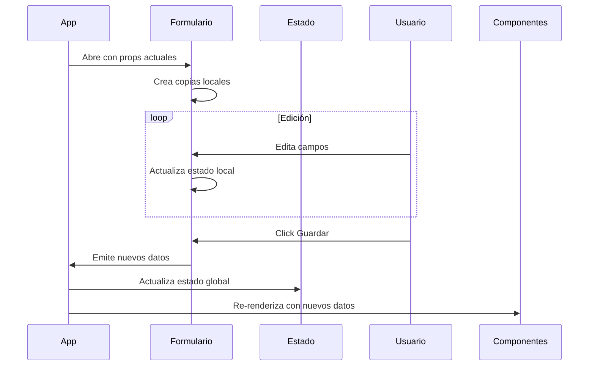

Aquí tienes un diagrama en formato Markdown con Mermaid que representa la estructura y funcionamiento de tu aplicación Vue:

```markdown
# Diagrama de la Aplicación Threat Intelligence Brief

```mermaid
flowchart TD
    A[App.vue] -->|contiene y gestiona estado| B[ResumenEjecutivo.vue]
    A --> C[IncidentesDetectados.vue]
    A --> D[ExploitsPublicados.vue]
    A --> E[VulnerabilidadesCVE.vue]
    A --> F[AlertasAmenazas.vue]
    A --> G[FuentesInteligencia.vue]
    A --> H[Mitigaciones.vue]
    A --> I[FormularioThreatIntelligenceBrief.vue]

    A -->|maneja| J[Estado Global]
    J --> K[mes, año]
    J --> L[totalVulnerabilidades]
    J --> M[vulnerabilidadesCriticas/Altas/Medias]
    J --> N[sectoresAfectados]
    J --> O[gruposRansomware]
    J --> P[campañasIngenieria]
    J --> Q[indicadores]
    J --> R[incidentes]
    J --> S[exploits]
    J --> T[cves]
    J --> U[alertas]
    J --> V[fuentes]
    J --> W[mitigaciones]

    subgraph "Flujo de Edición"
        A -->|click| I
        I -->|edita| J
        I -->|emite 'guardar'| A
        I -->|emite 'cerrar'| A
    end

    subgraph "Componentes Visuales"
        B -->|muestra| K
        B -->|muestra| L
        B -->|muestra| M
        B -->|muestra| N
        B -->|muestra| O
        B -->|muestra| P
        B -->|muestra| Q
        
        C -->|lista| R
        D -->|tabla| S
        E -->|detalla| T
        F -->|alertas| U
        G -->|referencias| V
        H -->|recomendaciones| W
    end

    subgraph "Interacciones Clave"
        B -->|scrollTo| C
        B -->|scrollTo| D
        B -->|scrollTo| E
        B -->|scrollTo| F
    end
```



## Explicación del Diagrama

1. **Estructura Principal**:
   - `App.vue` es el componente raíz que contiene todos los demás componentes
   - Gestiona el estado global que se distribuye a los componentes hijos

2. **Componentes Visuales**:
   - Cada componente muestra una sección específica del reporte
   - Reciben datos via props desde App.vue

3. **Flujo de Edición**:
   - El botón en App.vue abre `FormularioThreatIntelligenceBrief.vue`
   - El formulario edita copias locales y emite cambios al guardar

4. **Estado Global**:
   - Contiene todas las variables que definen el reporte
   - Se actualiza cuando el formulario emite los cambios

5. **Interacciones**:
   - Los indicadores en ResumenEjecutivo permiten navegar a secciones
   - El formulario centraliza todas las ediciones

## Flujo de Datos



Este diagrama muestra claramente:
- La jerarquía de componentes
- El flujo de datos unidireccional (props down, events up)
- El ciclo completo de edición
- Las relaciones entre los diferentes módulos